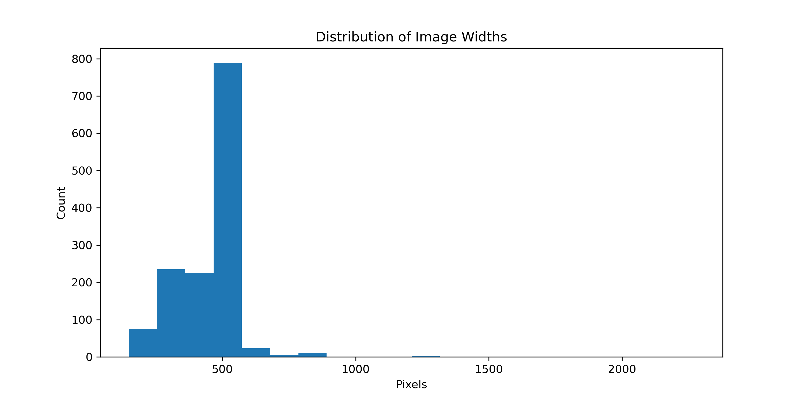

# Metadata

## Data Summary

Our dataset consists of images of dogs from 8 different breeds, which were selected from around 120 breeds in the original dataset. The breeds we chose are the French Bulldog, Schnauzer, German Shepherd, Miniature Poodle, Golden Retriever, Beagle, Shi-Tzu, and Siberian Husky. We chose these breeds because they are very popular and are all pretty distinguishable from one another; we felt this would give our model a better chance than picking breeds that are all very similar to one another. There are not an equal amount of images per dog breed, as that is the nature of the dataset. The Golden Retriever has the least number of images, at 152, and the Shi-Tzu has the most number of images, at 214. Because we are working with an image dataset, we don’t necessarily have columns in our dataset. Our data is in a PNG format separated into folders of each breed. Each image has a code, as to not include the breed name in the file name. The data can be accessed in the data folder of the github page:  https://github.com/gbharathit/DS-4002-Project-3/tree/main 

## Provenance

The dataset originates from the Stanford Dogs Dataset, from Stanford University. The original dataset contains images of 120 dog breeds, with a total of over 20,000 images. The dataset included both images and annotations, as well as lists with their testing and training splits. Because we are building our own CNN model and defining our own splits, we chose to pick specific breeds and simply download the images. We knew that due to the sheer size of our dataset, we would have to narrow down which breeds to pick in order for our model to stand a chance at being accurate as well as because of the time restraint we have to perform and present our analysis. We picked breeds based on both popularity and our own personal interest. We also chose to include all images for each breed. This was because we would not be able to sort through every image for every breed to exclude images that maybe only had a partial image of a dog or a lot of other objects, but also because we wanted to see how this would affect the accuracy of our model if we didn’t provide “perfect” images. Due to the nature of image data, we simply have the images organized into folders based on the breed for our own identification purposes but the image file name itself does not reveal the breed. The images are all merged into one dataset in order to run our model. 

## License

The original dataset is made publicly available through stanford.edu, specifically the Stanford Dogs Dataset webpage. Our refined version and analysis outputs will be shared in our GitHub repository under the same open-use conditions, following the Stanford Dogs Dataset authors’ licensing requirements and citing their work. 

## Ethical Statements

There is an ethical concern since some of the images do not just have a dog in it. In some of the images, there are humans in the picture, which leads to our ethical concerns. We have decided to just acknowledge this ethical concern that some people may be in these pictures unwillingly. Fixing this ethical concern would require us to go in manually and delete images that include a human, which would be a long process since we are dealing with over 1200 images. Furthermore, we want to see how our model does in the presence of other people in the picture, giving us a better idea of how accurate it is.

## Data Dictionary

| Column | Description | Potential Response |
| :------- | :------- | :------- |
| Image | Image of the dog | .jpg file |
| Label | Label of the breed of the dog | FrenchBulldog, Beagle, GermanShepherd, Shi-Tzu, GoldenRetriever, Schnauzer, MiniaturePoodle, Husky |

## Exploratory Plots

With this plot, we were able to clearly visualize if there are any major class imbalances in the data that could lead to predictions favoring one class over another. This plot shows that this does not look to be too big of an issue. Shi-Tzu, Beagle, and Siberian Husky have the most images, but many of the breeds have around 160 images. Thus, we do see class imbalance as a major issue.

With these plots, we were able to clearly visualize if there will be any issues moving forward in doing our analysis since CNN’s often require images of the same size. Many images are around the same size, but there are some bigger images as seen by the big range of the x axis. However, since many images are around the same size, we feel resizing the images for our analysis will be fine in looking at this.
